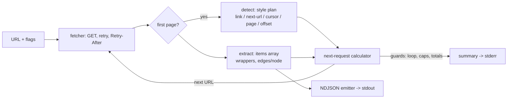

# depage

[English](README.md) | [中文](README.zh.md) | [日本語](README.ja.md)

[](LICENSE) [](go.mod) [](CHANGELOG.md)  [](CONTRIBUTING.md)

**depage：ページネーションされたあらゆる JSON API を 1 本の NDJSON ストリームに平坦化するオープンソース CLI——カーソル・offset・ページ番号・Link ヘッダーを最初のレスポンスから自動判別し、API ごとのアダプタコードは不要。**


```bash
git clone https://github.com/JaydenCJ/depage && cd depage
go build -o depage ./cmd/depage    # single static binary, stdlib only
```

> プレリリース：v0.1.0 はまだどのパッケージレジストリにもタグ付けされていません。上記の通りソースからビルドしてください（Go ≥1.22 なら可）。

## なぜ depage？

データエンジニアなら誰でもこのループを十数回書いたはず：エンドポイントを叩き、items 配列を探し、ボディからカーソルを取り出し（あるいは `Link` ヘッダーを読み、`?page=` を増やし、`?offset=` を進め）、再リクエストし、連結し、API が無限ループもレート制限もしないよう祈る。ループ自体は難しくない——ただ API ごとに毎回違うから、そのたびに書き直され、テストも中途半端になる。重量級の逃げ道（Airbyte、Singer）は API ごとのコネクタカタログで解決する：カタログにある API なら快適だが、5 分前に初めて触った社内サービスには無力だ。depage は別の道を行く：*最初のレスポンス*——ヘッダー、ボディのフィールド、クエリパラメータ——を検分し、その API が話す 5 つの一般的なページネーション方言のどれかを認識し、全ページを辿って各レコードを 1 行の JSON として stdout に流す。カーソル反復ガードと訪問済み URL 集合が「終わり」を言わない退化 API を止め、429/5xx はバックオフ付きで再試行し `Retry-After` を尊重する。あとは `jq` や DuckDB や `head` の仕事だ。本当に風変わりな API に当たったら、2 つのフラグ（`--items`、`--next`）でフィールドを固定できる——それでもコードは書かない。

| | depage | curl + jq ループ | API ごとの SDK スクリプト | Airbyte / Singer |
|---|---|---|---|---|
| 任意の API の全ページを 1 コマンドで | ✅ | ❌ API ごとに手書き | ❌ API ごとにコード | ⚠️ カタログ内 API のみ |
| カーソル / offset / ページ / Link ヘッダーを自動判別 | ✅ | ❌ | ❌ | ❌ コネクタごとの実装 |
| 社内・ドキュメントなし API でも使える | ✅ | ✅ ただし労力大 | ⚠️ SDK があれば | ❌ |
| ストリーミング NDJSON・一定メモリ | ✅ | ⚠️ 通常は全体をバッファ | まちまち | ⚠️ 独自形式 |
| ループガード、`Retry-After` 対応の再試行 | ✅ 内蔵 | ❌ 自作 | まちまち | ✅ |
| 最初のレコードまでの準備 | なし | なし | SDK + 定型コード | 基盤 + 設定 |
| ランタイム依存 | 0（静的バイナリ 1 個） | bash + curl + jq | 言語ランタイム + SDK | 数百パッケージ |

<sub>2026-07-13 確認：depage は Go 標準ライブラリのみを import。最小構成の Airbyte でも複数サービスが動き、Singer の各 tap はそれぞれ独自の依存一式を固定する。</sub>

## 特徴

- **アダプタの代わりに自動判別** — 最初のレスポンスから `Link: rel="next"` ヘッダー、next-URL フィールド（`links.next`、HAL、`@odata.nextLink`）、カーソル（`next_cursor`、`nextPageToken` など）、`?page=`、`?offset=` を、文書化された優先順位で調べる（[docs/detection.md](docs/detection.md)）。
- **レコードの在り処も見つける** — items 配列は一般的なラッパー（`data`、`results`、`hits.hits`、`_embedded` など）を最大 3 階層まで掘って特定し、GraphQL の `edges/node` は自動で展開；特殊な形は `--items` で固定。
- **バッファせず流す** — 各レコードは stdout 上の 1 行 JSON でページごとにフラッシュされるため、`depage … | head -3` のコストはレコード 3 件分で済み、データセット全体ではない；数値は元の表記のまま保たれる。
- **無限ループを拒否** — カーソルの反復はストリーム終端とみなし、URL の再訪は警告付きで停止し、`--max-pages` / `--max-items` が無条件に上限を張る。
- **失敗時も礼儀正しく** — 429 と 5xx は指数バックオフで再試行し `Retry-After` を尊重（上限 30s）；他の 4xx はレスポンス片付きで即座に失敗；`--delay` でページ取得の間隔を空けられる。
- **依存ゼロ・完全オフラインでテスト可能** — Go 標準ライブラリのみ、静的バイナリ 1 個、テレメトリなし；テストスイートとスモークスクリプトは 127.0.0.1 上の同梱 fixture サーバーとしか通信しない。

## クイックスタート

```bash
# any paginated endpoint — here the bundled offline fixture API
go run ./examples/fixture-server &    # prints: http://127.0.0.1:8080
depage 'http://127.0.0.1:8080/cursor/users?limit=10' > users.ndjson
head -3 users.ndjson
```

実際にキャプチャした出力：

```text
depage: style=cursor (via body field /next_cursor), pages=6, items=57
{"id":1,"name":"user-01","team":"atlas"}
{"id":2,"name":"user-02","team":"borealis"}
{"id":3,"name":"user-03","team":"cascade"}
```

サマリ行は stderr に出るので NDJSON のパイプは汚れない。`-v` は判別が何を見たかを表示する（これも実出力、同じ fixture の next-URL エンドポイントに対して）：

```text
depage: detected style=next-url via body field /links/next
depage: items found at /records (10 on the first page)
depage: page 1: 10 item(s) from http://127.0.0.1:8080/nexturl/users?page=1
depage: page 2: 10 item(s) from http://127.0.0.1:8080/nexturl/users?page=2&per_page=10
```

実際の API には、必要に応じて認証と上限を足す：

```bash
depage -H 'Authorization: Bearer TOKEN' --max-items 10000 \
  'https://api.example.test/v1/events?limit=100' | jq -c 'select(.level=="error")'
```

## ページネーションのスタイル

実行ごとに最初のレスポンスから 1 つのファミリーが選ばれる（[完全なリファレンス](docs/detection.md)）：

| スタイル | 判別材料 | ストリームの終了条件 |
|---|---|---|
| `link-header` | `Link: <…>; rel="next"` ヘッダー | next リンクなし |
| `next-url` | `links.next`、`@odata.nextLink`、`next` などの URL | フィールド欠落 / null / `""` |
| `cursor` | `next_cursor`、`nextPageToken` などのトークン | フィールドが空か反復 |
| `page` | `?page=` パラメータか `total_pages` フィールド | 最終ページ、空ページか短いページ |
| `offset` | `?offset=` / `?skip=` か `total` フィールド | total 到達、空ページか短いページ |
| `none` | どれにも該当せず | 単一ページの後 |

## CLI リファレンス

`depage [flags] <url>` — 終了コード：0 成功、1 HTTP/実行時失敗、2 使い方の誤り。

| フラグ | 既定値 | 効果 |
|---|---|---|
| `-H, --header` | — | リクエストヘッダーを追加、`'Name: value'`（繰り返し可） |
| `--style` | `auto` | ファミリーを強制：`link-header`、`next-url`、`cursor`、`offset`、`page`、`none` |
| `--items` | 自動 | items 配列への JSON pointer |
| `--next` | 自動 | 次カーソル / 次 URL フィールドへの JSON pointer |
| `--cursor-param` | 導出 | カーソルを送り返すクエリパラメータ名 |
| `--page-param` / `--offset-param` / `--limit-param` | 自動検出 | ページ / offset / ページサイズのクエリパラメータ名 |
| `--max-pages` / `--max-items` | 0 = 無制限 | 走査のハードキャップ |
| `--pages` | オフ | 項目ではなく生のページオブジェクトを 1 行ずつ出力 |
| `--retries` | 2 | 429/5xx/ネットワークエラー時の再試行回数 |
| `--retry-wait` | 500ms | バックオフ基準値、試行ごとに倍増（`Retry-After` 優先） |
| `--delay` | 0 | ページ取得間の礼儀としての待機 |
| `--timeout` | 30s | リクエストごとのタイムアウト |
| `-q` / `-v` | オフ | サマリの抑制 / ページごとの判別トレース |

## 検証

このリポジトリに CI はない。上記の主張はすべてローカル実行で検証される：

```bash
go test ./...            # 92 deterministic tests, offline, < 5 s
bash scripts/smoke.sh    # end-to-end against the fixture API, prints SMOKE OK
```

## アーキテクチャ



## ロードマップ

- [x] v0.1.0 — 5 つのページネーションファミリーの自動判別、ラッパー対応の項目抽出、ストリーミング NDJSON、ループガード、再試行/バックオフ、オフライン fixture サーバー、92 テスト + スモークスクリプト
- [ ] 導出カーソル：最後のレコードのフィールドでページ送りする `starting_after` 型 API（Stripe 方言）
- [ ] `has_more` フラグ対応（導出カーソルとの組み合わせ）
- [ ] POST ページネーション（カーソルを JSON リクエストボディに載せる GraphQL・検索エンドポイント）
- [ ] 独立ページの並行プリフェッチ（offset/page ファミリー）、`--prefetch` で有効化
- [ ] レジューム対応：最後のカーソルを永続化し、中断されたエクスポートを再開

完全な一覧は [open issues](https://github.com/JaydenCJ/depage/issues) を参照。

## コントリビュート

issue・議論・PR を歓迎します——ローカルの手順（フォーマット、vet、テスト、`SMOKE OK`）は [CONTRIBUTING.md](CONTRIBUTING.md) を参照。入門向けタスクには [good first issue](https://github.com/JaydenCJ/depage/issues?q=is%3Aissue+is%3Aopen+label%3A%22good+first+issue%22) のラベルが付き、設計の議論は [Discussions](https://github.com/JaydenCJ/depage/discussions) で。

## ライセンス

[MIT](LICENSE)
