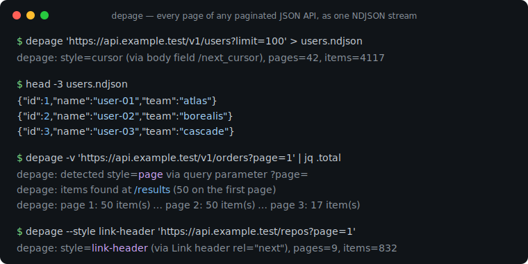
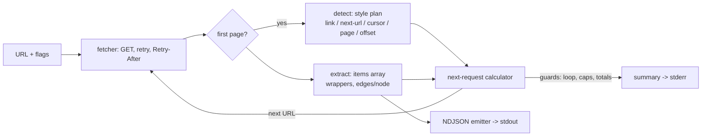

# depage

[English](README.md) | [中文](README.zh.md) | [日本語](README.ja.md)

[](LICENSE) [](go.mod) [](CHANGELOG.md)  [](CONTRIBUTING.md)

**depage：an open-source CLI that flattens any paginated JSON API into one NDJSON stream — cursors, offsets, page numbers, and Link headers auto-detected from the first response, no per-API adapter code.**



```bash
git clone https://github.com/JaydenCJ/depage && cd depage
go build -o depage ./cmd/depage    # single static binary, stdlib only
```

> Pre-release: v0.1.0 is not tagged on a package registry yet; build from source as above (any Go ≥1.22).

## Why depage?

Every data engineer has written this loop a dozen times: call the endpoint, find the items array, pull the cursor out of the body (or the `Link` header, or increment `?page=`, or bump `?offset=`), request again, concatenate, and hope the API doesn't loop forever or rate-limit you mid-run. The loop is never hard — it is just different for every API, so it gets rewritten, half-tested, for each one. The heavyweight escape hatches (Airbyte, Singer) solve it with per-API connector catalogs: great when your API is in the catalog, useless for the in-house service you talked to five minutes ago. depage takes the other route: it inspects the *first response* — headers, body fields, query parameters — and recognizes which of the five common pagination dialects the API speaks, then walks every page and streams each record as one JSON line to stdout. Cursor repeat guards and a visited-URL set stop the degenerate APIs that never say "done"; 429/5xx get retried with backoff and `Retry-After` respected; `jq`, DuckDB, or `head` handle the rest. When auto-detection meets a truly exotic API, two flags (`--items`, `--next`) pin the exact fields — still no code.

| | depage | curl + jq loop | per-API SDK script | Airbyte / Singer |
|---|---|---|---|---|
| All pages of an arbitrary API in one command | ✅ | ❌ hand-written per API | ❌ code per API | ⚠️ only cataloged APIs |
| Detects cursor / offset / page / Link header automatically | ✅ | ❌ | ❌ | ❌ per-connector code |
| Works on in-house and undocumented APIs | ✅ | ✅ with effort | ⚠️ if an SDK exists | ❌ |
| Streaming NDJSON, constant memory | ✅ | ⚠️ usually buffers | varies | ⚠️ own formats |
| Loop guards, retry with `Retry-After` | ✅ built in | ❌ DIY | varies | ✅ |
| Setup before the first record | none | none | SDK + boilerplate | platform + config |
| Runtime dependencies | 0 (one static binary) | bash + curl + jq | language runtime + SDK | hundreds of packages |

<sub>Checked 2026-07-13: depage imports the Go standard library only; a minimal Airbyte deployment runs multiple services; Singer taps each pin their own dependency set.</sub>

## Features

- **Auto-detection instead of adapters** — the first response is inspected for `Link: rel="next"` headers, next-URL fields (`links.next`, HAL, `@odata.nextLink`), cursors (`next_cursor`, `nextPageToken`, …), `?page=`, and `?offset=`, in a documented priority order ([docs/detection.md](docs/detection.md)).
- **Finds the records too** — the items array is located through common wrappers (`data`, `results`, `hits.hits`, `_embedded`, …) up to three levels deep, GraphQL `edges/node` unwrapped; `--items` pins exotic shapes.
- **Streams, never buffers** — each record is one JSON line on stdout, flushed page by page, so `depage … | head -3` costs three records, not the whole dataset; numbers keep their exact textual form.
- **Refuses to loop forever** — repeated cursors end the stream, revisited URLs stop the walk with a warning, and `--max-pages` / `--max-items` cap it unconditionally.
- **Polite under failure** — 429 and 5xx are retried with exponential backoff, `Retry-After` honored (capped at 30s); other 4xx fail immediately with the response snippet; `--delay` spaces out page fetches.
- **Zero dependencies, fully offline-testable** — Go standard library only, one static binary, no telemetry; the test suite and smoke script talk exclusively to a bundled fixture server on 127.0.0.1.

## Quickstart

```bash
# any paginated endpoint — here the bundled offline fixture API
go run ./examples/fixture-server &    # prints: http://127.0.0.1:8080
depage 'http://127.0.0.1:8080/cursor/users?limit=10' > users.ndjson
head -3 users.ndjson
```

Real captured output:

```text
depage: style=cursor (via body field /next_cursor), pages=6, items=57
{"id":1,"name":"user-01","team":"atlas"}
{"id":2,"name":"user-02","team":"borealis"}
{"id":3,"name":"user-03","team":"cascade"}
```

The summary line goes to stderr, so the NDJSON pipe stays clean. `-v` shows what detection saw (real output again, against the same fixture's next-URL endpoint):

```text
depage: detected style=next-url via body field /links/next
depage: items found at /records (10 on the first page)
depage: page 1: 10 item(s) from http://127.0.0.1:8080/nexturl/users?page=1
depage: page 2: 10 item(s) from http://127.0.0.1:8080/nexturl/users?page=2&per_page=10
```

For a real API, add auth and caps as needed:

```bash
depage -H 'Authorization: Bearer TOKEN' --max-items 10000 \
  'https://api.example.test/v1/events?limit=100' | jq -c 'select(.level=="error")'
```

## Pagination styles

One family is chosen per run, from the first response ([full reference](docs/detection.md)):

| Style | Detected from | Stream ends when |
|---|---|---|
| `link-header` | `Link: <…>; rel="next"` header | no next link |
| `next-url` | URL in `links.next`, `@odata.nextLink`, `next`, … | field absent / null / `""` |
| `cursor` | token in `next_cursor`, `nextPageToken`, … | field empty or repeats |
| `page` | `?page=` parameter or `total_pages` field | last page, empty or short page |
| `offset` | `?offset=` / `?skip=` or `total` field | total reached, empty or short page |
| `none` | nothing matched | after the single page |

## CLI reference

`depage [flags] <url>` — exit codes: 0 ok, 1 HTTP/runtime failure, 2 usage error.

| Flag | Default | Effect |
|---|---|---|
| `-H, --header` | — | add a request header, `'Name: value'` (repeatable) |
| `--style` | `auto` | force a family: `link-header`, `next-url`, `cursor`, `offset`, `page`, `none` |
| `--items` | auto | JSON pointer to the items array |
| `--next` | auto | JSON pointer to the next cursor / next URL field |
| `--cursor-param` | derived | query parameter that carries the cursor back |
| `--page-param` / `--offset-param` / `--limit-param` | detected | query parameter names for page / offset / page size |
| `--max-pages` / `--max-items` | 0 = unlimited | hard caps on the walk |
| `--pages` | off | emit one raw page object per line instead of items |
| `--retries` | 2 | retries on 429/5xx/network errors |
| `--retry-wait` | 500ms | base backoff, doubled per attempt (`Retry-After` wins) |
| `--delay` | 0 | politeness delay between page fetches |
| `--timeout` | 30s | per-request timeout |
| `-q` / `-v` | off | suppress the summary / trace detection per page |

## Verification

This repository ships no CI; every claim above is verified by local runs:

```bash
go test ./...            # 92 deterministic tests, offline, < 5 s
bash scripts/smoke.sh    # end-to-end against the fixture API, prints SMOKE OK
```

## Architecture



## Roadmap

- [x] v0.1.0 — auto-detection of five pagination families, wrapper-aware item extraction, streaming NDJSON, loop guards, retry/backoff, offline fixture server, 92 tests + smoke script
- [ ] Derived cursors: `starting_after`-style APIs that paginate by the last item's field (Stripe dialect)
- [ ] `has_more`-flag support paired with derived cursors
- [ ] POST pagination (GraphQL and search endpoints that take the cursor in a JSON request body)
- [ ] Concurrent prefetch of independent pages (offset/page families) behind `--prefetch`
- [ ] Resume support: persist the last cursor and continue an interrupted export

See the [open issues](https://github.com/JaydenCJ/depage/issues) for the full list.

## Contributing

Issues, discussions and pull requests are welcome — see [CONTRIBUTING.md](CONTRIBUTING.md) for the local workflow (format, vet, tests, `SMOKE OK`). Good entry points are labelled [good first issue](https://github.com/JaydenCJ/depage/issues?q=is%3Aissue+is%3Aopen+label%3A%22good+first+issue%22), and design questions live in [Discussions](https://github.com/JaydenCJ/depage/discussions).

## License

[MIT](LICENSE)
