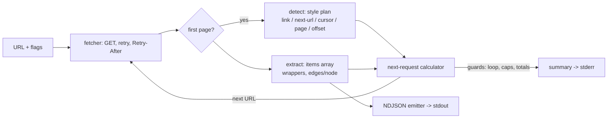

# depage

[English](README.md) | [中文](README.zh.md) | [日本語](README.ja.md)

[](LICENSE) [](go.mod) [](CHANGELOG.md)  [](CONTRIBUTING.md)

**depage：开源 CLI，把任何分页 JSON API 压平成一条 NDJSON 流——游标、offset、页码、Link 头一律从首个响应自动识别，无需为每个 API 写适配代码。**


```bash
git clone https://github.com/JaydenCJ/depage && cd depage
go build -o depage ./cmd/depage    # single static binary, stdlib only
```

> 预发布：v0.1.0 尚未在任何包仓库打 tag；请按上面的方式从源码构建（Go ≥1.22 均可）。

## 为什么选 depage？

每位数据工程师都写过十几遍这个循环：请求端点、找到 items 数组、从响应体里抠出游标（或者读 `Link` 头、或者递增 `?page=`、或者加大 `?offset=`）、再请求、再拼接，然后祈祷 API 不会无限循环、不会在半途限流。这个循环从来不难写——难的是每个 API 都不一样，于是它被一遍遍重写，且大多只测了一半。重型方案（Airbyte、Singer）靠逐 API 的连接器目录解决：API 在目录里时很好用，对你五分钟前刚接触的内部服务则毫无办法。depage 走另一条路：它检视*首个响应*——头部、响应体字段、查询参数——识别出该 API 说的是五种常见分页方言中的哪一种，然后逐页遍历，把每条记录作为一行 JSON 流式写到 stdout。游标重复守卫加已访问 URL 集合能止住那些永远不说"结束"的退化 API；429/5xx 会带退避重试并尊重 `Retry-After`；剩下的交给 `jq`、DuckDB 或 `head`。遇到真正奇特的 API 时，两个 flag（`--items`、`--next`）即可钉住确切字段——依然不用写代码。

| | depage | curl + jq 循环 | 逐 API 的 SDK 脚本 | Airbyte / Singer |
|---|---|---|---|---|
| 一条命令拿到任意 API 的全部页 | ✅ | ❌ 每个 API 手写 | ❌ 每个 API 写代码 | ⚠️ 仅目录内 API |
| 自动识别游标 / offset / 页码 / Link 头 | ✅ | ❌ | ❌ | ❌ 逐连接器实现 |
| 适用于内部及无文档 API | ✅ | ✅ 但费力 | ⚠️ 需有 SDK | ❌ |
| 流式 NDJSON、常量内存 | ✅ | ⚠️ 通常整体缓冲 | 视情况 | ⚠️ 自有格式 |
| 循环守卫、带 `Retry-After` 的重试 | ✅ 内置 | ❌ 自己造 | 视情况 | ✅ |
| 拿到第一条记录前的准备工作 | 无 | 无 | SDK + 样板代码 | 平台 + 配置 |
| 运行时依赖 | 0（单个静态二进制） | bash + curl + jq | 语言运行时 + SDK | 数百个包 |

<sub>核查于 2026-07-13：depage 仅引用 Go 标准库；最小化的 Airbyte 部署也要跑多个服务；每个 Singer tap 各自钉一套依赖。</sub>

## 特性

- **用自动识别代替适配器** — 首个响应会被检查是否有 `Link: rel="next"` 头、next-URL 字段（`links.next`、HAL、`@odata.nextLink`）、游标（`next_cursor`、`nextPageToken` 等）、`?page=` 与 `?offset=`，优先级顺序有文档（[docs/detection.md](docs/detection.md)）。
- **连记录也帮你找** — items 数组会穿过常见包装层（`data`、`results`、`hits.hits`、`_embedded` 等）最深三层定位，GraphQL 的 `edges/node` 自动拆开；奇特结构用 `--items` 钉住。
- **只流式、不缓冲** — 每条记录是 stdout 上的一行 JSON，按页刷新，所以 `depage … | head -3` 只花三条记录的代价，而不是整个数据集；数字保持原始文本形态。
- **拒绝无限循环** — 游标重复即视为流结束，重访 URL 会带警告停止遍历，`--max-pages` / `--max-items` 无条件封顶。
- **失败时保持礼貌** — 429 与 5xx 按指数退避重试并尊重 `Retry-After`（上限 30s）；其余 4xx 立即失败并附响应片段；`--delay` 可拉开翻页间隔。
- **零依赖、完全可离线测试** — 仅 Go 标准库，单个静态二进制，无遥测；测试套件与冒烟脚本只跟 127.0.0.1 上自带的 fixture 服务器通信。

## 快速上手

```bash
# any paginated endpoint — here the bundled offline fixture API
go run ./examples/fixture-server &    # prints: http://127.0.0.1:8080
depage 'http://127.0.0.1:8080/cursor/users?limit=10' > users.ndjson
head -3 users.ndjson
```

实际捕获的输出：

```text
depage: style=cursor (via body field /next_cursor), pages=6, items=57
{"id":1,"name":"user-01","team":"atlas"}
{"id":2,"name":"user-02","team":"borealis"}
{"id":3,"name":"user-03","team":"cascade"}
```

摘要行走 stderr，NDJSON 管道保持干净。`-v` 会展示识别过程看到了什么（同样是实际输出，对着同一 fixture 的 next-URL 端点）：

```text
depage: detected style=next-url via body field /links/next
depage: items found at /records (10 on the first page)
depage: page 1: 10 item(s) from http://127.0.0.1:8080/nexturl/users?page=1
depage: page 2: 10 item(s) from http://127.0.0.1:8080/nexturl/users?page=2&per_page=10
```

对真实 API，按需加上认证与上限：

```bash
depage -H 'Authorization: Bearer TOKEN' --max-items 10000 \
  'https://api.example.test/v1/events?limit=100' | jq -c 'select(.level=="error")'
```

## 分页风格

每次运行从首个响应中选定一个家族（[完整参考](docs/detection.md)）：

| 风格 | 识别依据 | 流结束条件 |
|---|---|---|
| `link-header` | `Link: <…>; rel="next"` 头 | 没有 next 链接 |
| `next-url` | `links.next`、`@odata.nextLink`、`next` 等里的 URL | 字段缺失 / null / `""` |
| `cursor` | `next_cursor`、`nextPageToken` 等里的 token | 字段为空或重复 |
| `page` | `?page=` 参数或 `total_pages` 字段 | 到最后一页、空页或短页 |
| `offset` | `?offset=` / `?skip=` 或 `total` 字段 | 达到 total、空页或短页 |
| `none` | 均未命中 | 单页之后 |

## CLI 参考

`depage [flags] <url>` — 退出码：0 成功，1 HTTP/运行时失败，2 用法错误。

| Flag | 默认值 | 作用 |
|---|---|---|
| `-H, --header` | — | 添加请求头，`'Name: value'`（可重复） |
| `--style` | `auto` | 强制家族：`link-header`、`next-url`、`cursor`、`offset`、`page`、`none` |
| `--items` | 自动 | 指向 items 数组的 JSON pointer |
| `--next` | 自动 | 指向下一游标 / 下一 URL 字段的 JSON pointer |
| `--cursor-param` | 派生 | 回传游标所用的查询参数名 |
| `--page-param` / `--offset-param` / `--limit-param` | 自动检测 | 页码 / offset / 页大小的查询参数名 |
| `--max-pages` / `--max-items` | 0 = 不限 | 遍历的硬上限 |
| `--pages` | 关 | 每行输出一个原始页对象而非条目 |
| `--retries` | 2 | 429/5xx/网络错误的重试次数 |
| `--retry-wait` | 500ms | 退避基数，逐次翻倍（`Retry-After` 优先） |
| `--delay` | 0 | 翻页之间的礼貌性间隔 |
| `--timeout` | 30s | 单请求超时 |
| `-q` / `-v` | 关 | 抑制摘要 / 逐页打印识别轨迹 |

## 验证

本仓库不带 CI；上面的每一条主张都由本地运行验证：

```bash
go test ./...            # 92 deterministic tests, offline, < 5 s
bash scripts/smoke.sh    # end-to-end against the fixture API, prints SMOKE OK
```

## 架构



## 路线图

- [x] v0.1.0 — 五种分页家族的自动识别、感知包装层的条目提取、流式 NDJSON、循环守卫、重试/退避、离线 fixture 服务器、92 个测试 + 冒烟脚本
- [ ] 派生游标：按最后一条记录的字段分页的 `starting_after` 型 API（Stripe 方言）
- [ ] `has_more` 标志支持，与派生游标配套
- [ ] POST 分页（游标放在 JSON 请求体里的 GraphQL 与搜索端点）
- [ ] 独立页的并发预取（offset/page 家族），由 `--prefetch` 开启
- [ ] 断点续传：持久化最后的游标，继续被中断的导出

完整列表见 [open issues](https://github.com/JaydenCJ/depage/issues)。

## 参与贡献

欢迎 issue、讨论与 PR——本地流程（格式化、vet、测试、`SMOKE OK`）见 [CONTRIBUTING.md](CONTRIBUTING.md)。入门任务标注为 [good first issue](https://github.com/JaydenCJ/depage/issues?q=is%3Aissue+is%3Aopen+label%3A%22good+first+issue%22)，设计讨论在 [Discussions](https://github.com/JaydenCJ/depage/discussions)。

## 许可证

[MIT](LICENSE)
